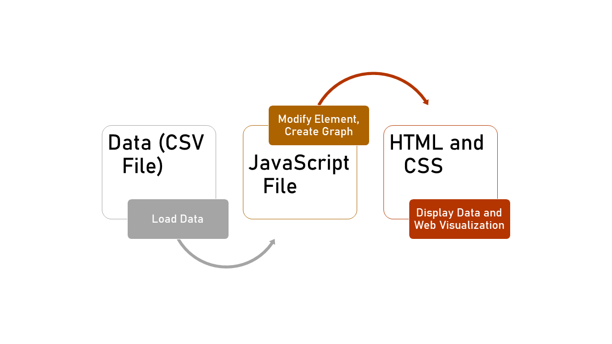
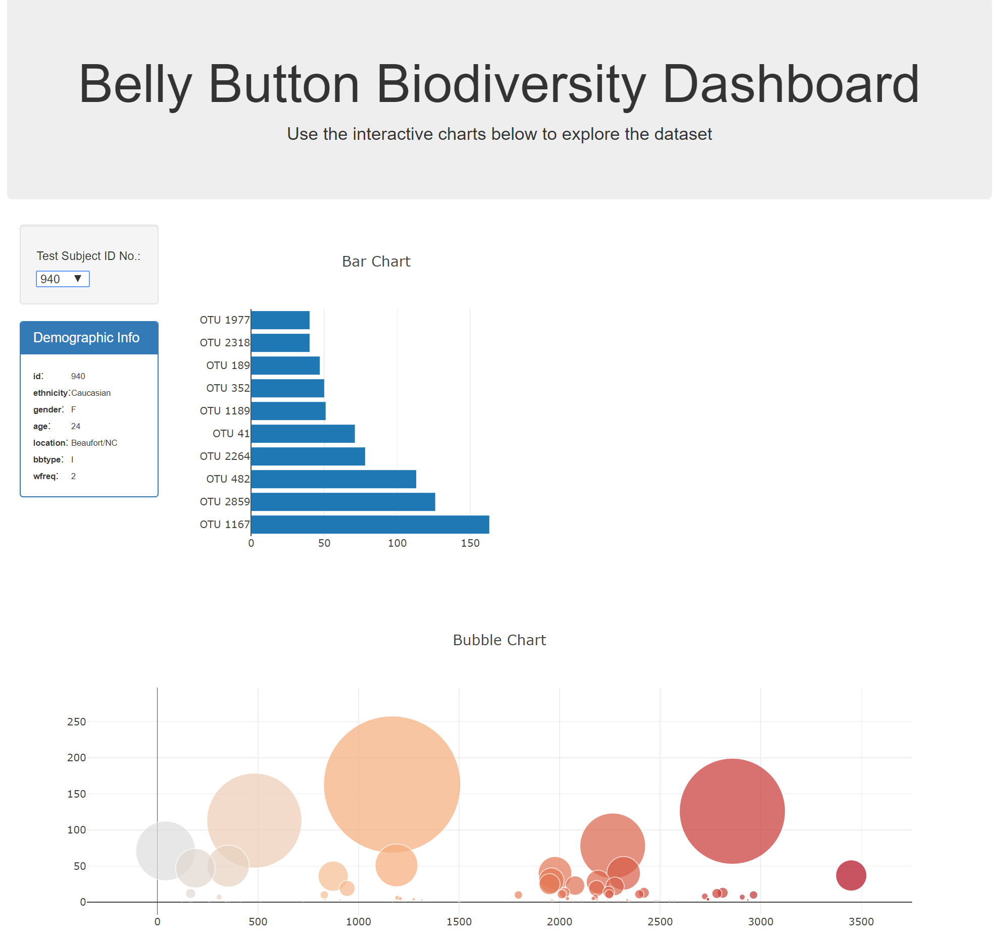

# Plotly Challenge

### 1. Background 

**Project Background:** In this plotly project, we will plot the Belly Button washing data from `samples.json` and display it in several ways: 
I) table info, II) bar chart, and III) bubble chart. 

### 2. Methodology 

**Methodology:** We will use Javascript, D3, and Plotly for this challenge. 

### 3. Data Source

The first thing we need to do is to understand the data structure. Trying to visualize the data structure will make us understand the required 
assignment better and to understand which data needs to be displayed in which parts. Belly button data consits of 3 arrays. The second and third array 
(`metadata` and `samples`) consists of several objects. We will filter the data dynamically based on the ID called in the first array (`names`). 

* Drop Down 
Drop down will use `names` array. The rest of data visualization will be filtered based on ID in this drop down. 

* Table Info
Drop down will use `metadata` array. 

* Bar Chart & Bubble Chart
Drop down will use `samples` array. 

### 4. Result

* File output for html code is  `index.html` 
* File output for Javascript code is  `app.js` under `static` and `js` folder

